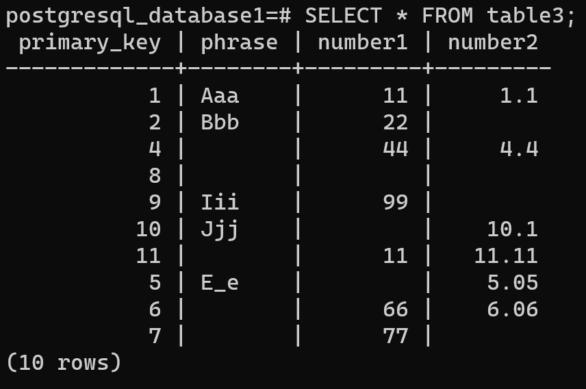

# Uniform C++ interface (thanks to SOCI library) to perform CRUD operations on various databases: SQLite3, MySQL, PostgreSql, MS SQL Server

## Table records for standard C++ data types

It is shown here how - with only C++ - to write/read data into/from prominent databases such as: SQLite3, MySQL, PostgreSql, MS SQL Server. The focus is to exemplify CRUD operations: 
- create (i.e. insert)
- read
- update
- delete 
on basic C++ data type:
- bool
- char
- std::string
- int
- double
- std::tm (i.e. date, time, and date-time or timestamp).

Null values can be entered or read into/from databases with the help of std::optional. Tables are defined by the following structs with represent a row of a table; primary key is automatically incremented and so it is not a struct field:
```
struct Record1 final
{
    bool trueOrFalse {};
    char letter {};
    std::string phrase {};
    int number1 {0};
    double number2 {0.0};
};

struct Tm : std::tm { ... };

struct Record2 final
{
    Tm dateOnly {};
    Tm timeOnly {};
    Tm dateTime {};
};

struct Record3 final
{
    std::optional<std::string> phrase {};
    std::optional<int> number1 {0};
    std::optional<double> number2 {0.0};
};
```

## Database connections 

To connect to a particular database, one of the following needs to be invoked:
```
soci::session sql(soci::sqlite3, databaseName);
soci::session sql(soci::mysql, "db=mysql user=root");
soci::session sql(soci::postgresql, "dbname=postgres");
```
There is a minor difference for MS SQL Server, but the main difficulty with the latter is to install it on Linux (it requires its own Docker container), and has not yet been attempted as of this writing. Therefore CRUD operations for MS SQL Server are temporarily blank, but will be filled in shortly - and similarly to the other databases which already work.

## Pleasant user interface for CRUD operations

```
sql << "INSERT INTO"
    << " "
    << tableName
    << " "
    << "(true_or_false, letter, phrase, number1, number2)"
    << " VALUES "
    << "(:true_or_false, :letter, :phrase, :number1, :number2)";
```

```
sql << "SELECT * FROM"
    << " "
    << tableName
    << " "
    << "WHERE primary_key = :primary_key";
```

```
sql << "UPDATE"
    << " "
    << tableName
    << " "
    << "SET true_or_false = :true_or_false, letter = :letter, phrase = :phrase, number1 = :number1, number2 = :number2"
    << " "
    << "WHERE primary_key = :primary_key";
```

```
sql << "DELETE FROM"
    << " "
    << tableName
    << " "
    << "WHERE primary_key = :primary_key";
```

## Commands to build, run, and test the program

```
git clone --depth 1 https://github.com/MariuszJozef/DatabaseGuiIntegration.git
cd DatabaseGuiIntegration
```

Start MySql and PostgreSql servers, make sure their status is "active (running)":
```
systemctl start mysqld
systemctl status mysqld
```


```
systemctl start postgresql
systemctl status postgresql
```


At the end of running the program remember to switch off database servers:
```
systemctl stop mysqld
systemctl stop postgresql
```

**N.B.**

For now SOCI can only be linked as a shared library, there are link errors when linking it statically, therefore **do not** set the flag:
`-D linkSociAsSharedLibrary=OFF`; it is omitted below and defaults to `ON`.

```
cmake --preset NMake-Msvc-Debug
cmake --build --preset NMake-Msvc-Debug
cmake --build --preset NMake-Msvc-Debug --target run
cmake --build --preset NMake-Msvc-Debug --target runUnitTest
cmake --build --preset NMake-Msvc-Debug --target runIntegrationTest
cmake --build --preset NMake-Msvc-Debug --target runAllTests
cmake --build --preset NMake-Msvc-Debug --target runAll
ctest --preset NMake-Msvc-Debug --output-on-failure
```

```
cmake --preset Make-Gnu-Debug
cmake --build --preset Make-Gnu-Debug
cmake --build --preset Make-Gnu-Debug --target run
cmake --build --preset Make-Gnu-Debug --target runUnitTest
cmake --build --preset Make-Gnu-Debug --target runIntegrationTest
cmake --build --preset Make-Gnu-Debug --target runAllTests
cmake --build --preset Make-Gnu-Debug --target runAll
ctest --preset Make-Gnu-Debug --output-on-failure
```

```
cmake --preset Make-Clang-Debug
cmake --build --preset Make-Clang-Debug
cmake --build --preset Make-Clang-Debug --target run
cmake --build --preset Make-Clang-Debug --target runUnitTest
cmake --build --preset Make-Clang-Debug --target runIntegrationTest
cmake --build --preset Make-Clang-Debug --target runAllTests
cmake --build --preset Make-Clang-Debug --target runAll
ctest --preset Make-Clang-Debug --output-on-failure
```

## Confirmation that database tables are filled

At the start of program execution, databases are dropped and created anew, therefore the tables shown below have indeed been filled by this C++ program, and not by manual (or otherwise) SQL statements. NULL values can be seen in the third table for each database below.

### Data entered into MySql tables


### Data entered into PostgreSql tables




### Data entered into SQLite3 tables


## Unit Tests confirm that data can be read from tables

Data from tables can be retrieved and stored:
- individual rows into struct variables
- whole tables or multiple rows into vectors or row structs.

Skeleton of unit tests is in place and works. The meat of tests will be completed very soon ;~D

In the meantime, when the program is run it prints out the data retrieved from tables

### Data retrieved from SQLite3 tables


### Data retrieved from MySql tables


### Data retrieved from PostgreSql tables


